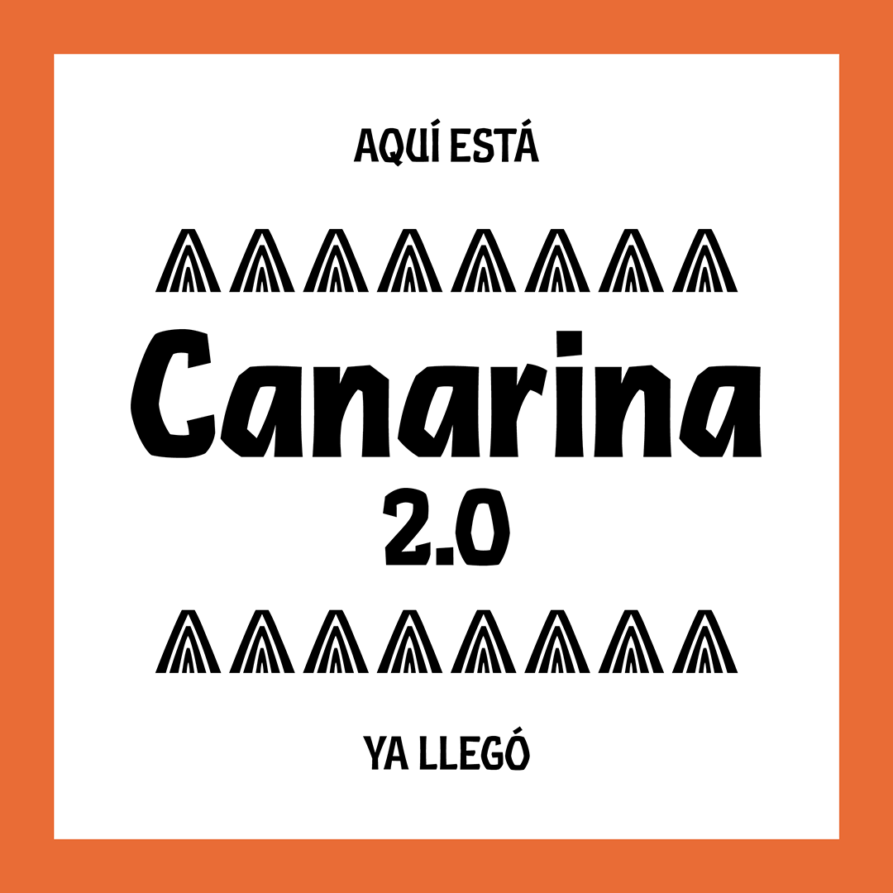
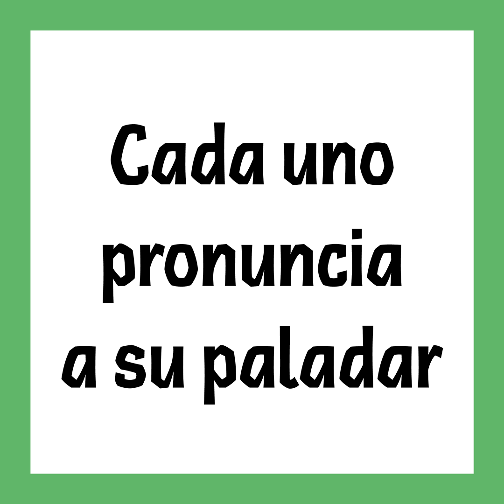
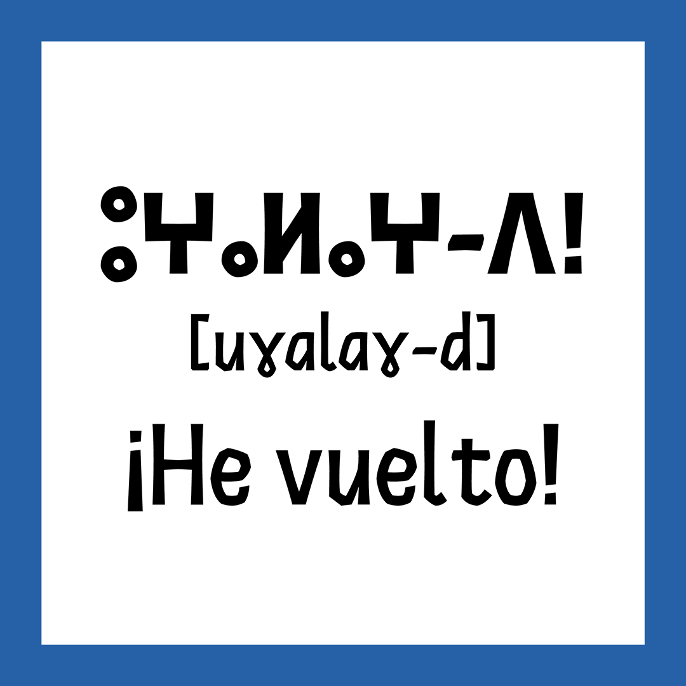
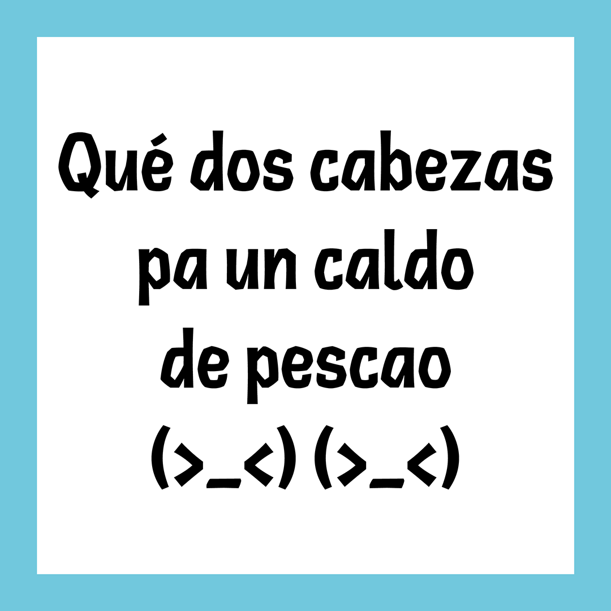
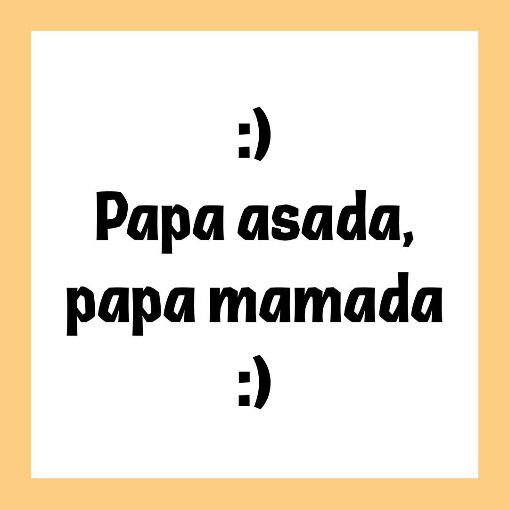

# Canarina

<strong>[EN]</strong>

Canarina is a font inspired by the Canary Islands, that aims to recreate traces of their history and character. Canarina takes it’s name from a plant called Canarina canariensis, a vine with red bell-shaped flowers, which is one of the symbols of the islands.

Unfortunately, the Canary Islands don’t have a strong typographic tradition. Most of the metal types that were used to print books locally were imported from Europe, so they’re not qualitatively different from the ones used on Spanish (and other European) presses at the time. The inspiration for Canarina comes instead from other graphic arts of the XXth century, and in particular the works of Eduardo Millares Sall (creator of the Cho-Juaá character) and César Manrique (an informalist painter and abstract sculptor). The shapes of their plastic works got reflected in the wide angles of the letters. Its overall design also presents a strong vernacular look.

Canarina is a fingerprint, a phonolitic stone, the leaf of a succulent plant, the silhouette of a volcanic rock against the sky, a feeling that’s hard to translate.

<strong>[FR]</strong>

Canarina est une fonte typographique inspirée par les îles Canaries, qui vise à recréer des traces de leur histoire et de leur caractère. Canarina tire son nom d’une plante appelée Canarina canariensis, une plante grimpante à fleurs rouges en forme de cloche, qui est l’un des symboles des îles.

Malheureusement, les îles Canaries n’ont pas une forte tradition typographique. La plupart des types en métal utilisés pour imprimer des livres localement ont été importés d’Europe, donc ils ne sont pas qualitativement différents de ceux utilisés sur les presses espagnoles (et autres européennes). L’inspiration pour Canarina provient plutôt d’autres arts graphiques du XXe siècle, et en particulier des œuvres d’Eduardo Millares Sall (créateur du personnage Cho-Juaá) et de César Manrique (peintre informaliste et sculpteur abstrait). Les formes de leurs œuvres plastiques se reflètent dans les grands angles des lettres. Sa conception globale présente également un fort caractère vernaculaire.

Canarina est une empreinte digitale, une pierre phonolitique, la feuille d’une plante succulente, la silhouette d’une roche volcanique contre le ciel, un sentiment difficile à traduire.

<strong>[ES]</strong>

Canarina es un tipo de letra inspirado por las Islas Canarias, cuyo objetivo es el de recrear rastros de su historia y carácter. Canarina toma su nombre de una planta llamada Canarina canariensis, una enredadera con flores rojas en forma de campana, que es uno de los símbolos de las islas.

Desafortunadamente, las Islas Canarias no tienen una fuerte tradición tipográfica. La mayoría de los tipos en metal que se usaban para imprimir libros localmente se importaban de Europa, por lo que no son cualitativamente diferentes de los utilizados en las prensas españolas (y europeas). La inspiración para Canarina proviene en cambio de otras artes gráficas del siglo XX, y en particular de las obras de Eduardo Millares Sall (creador del personaje Cho-Juaá) y de César Manrique (un pintor informalista y escultor abstracto). Las formas de sus trabajos plásticos se reflejaron en los amplios ángulos de las letras. Su diseño general también presenta un fuerte aspecto vernacular.

Canarina es una huella digital, una piedra fonolítica, la hoja de una planta suculenta, la silueta de una roca volcánica contra el cielo, un sentimiento que es difícil de traducir.

## Specimen

## License

Canarina is licensed under the SIL Open Font License, Version 1.1.
This license is copied below, and is also available with a FAQ at
http://scripts.sil.org/OFL

## Repository Layout

This font repository follows the Unified Font Repository v2.0,
a standard way to organize font project source files. Learn more at
https://github.com/unified-font-repository/Unified-Font-Repository
